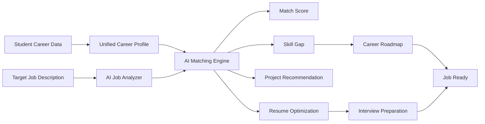
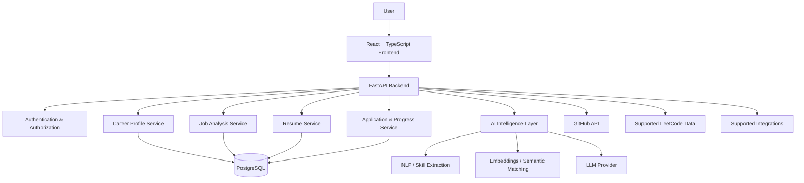
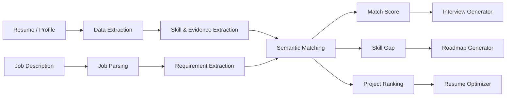
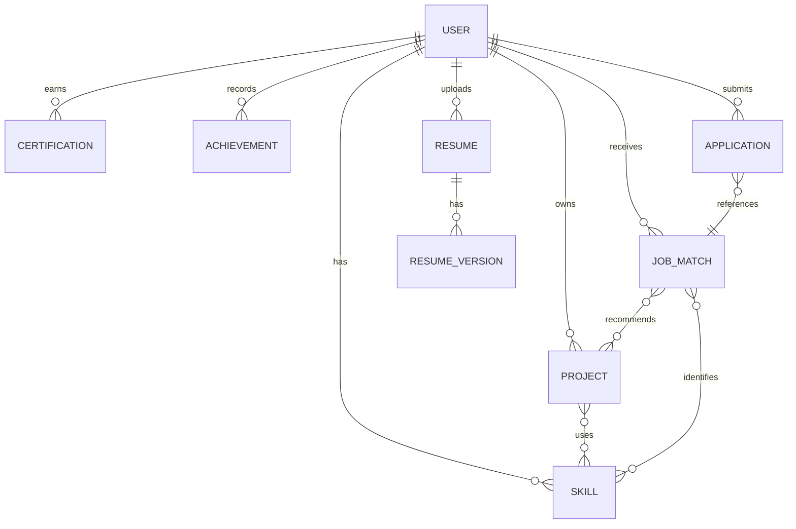
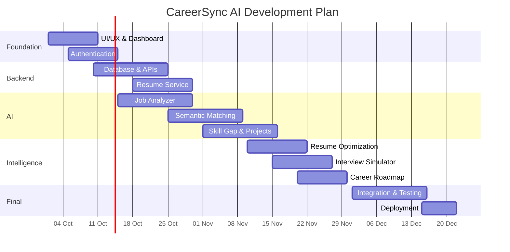

# 🚀 CareerSync AI

Developed in the AI Lab
By: Raunak Kumari(2402221530097)
    Kumar Arnav (240222130071)
    Ritika(2402221530103)
Under the supervision of Ms. Anjali Srivastava


### **AI-Powered Unified Career Intelligence Platform**

> **Your Career Data. One Intelligent Profile.**

CareerSync AI is a career intelligence platform designed to help students and job seekers transform scattered career information into a **single, intelligent, job-ready profile**.

The platform brings together a user's **resume, projects, skills, GitHub, LeetCode, LinkedIn, certifications and achievements**, then uses AI to compare the profile with a target job and provide actionable recommendations.

---

## 👥 Project Team

| Member | Primary Responsibility | Key Areas |
|---|---|---|
| **Raunak Kumari** | Project Lead & Frontend / Product | UI/UX, React frontend, dashboard, profile workflow, resume studio, integration of AI features |
| **Kumar Arnav** | Backend & Database Lead | FastAPI backend, REST APIs, authentication, PostgreSQL, data models, integrations |
| **Ritika** | AI / Data & QA Lead | NLP pipeline, job analysis, semantic matching, skill-gap engine, project recommendation, testing & documentation |

### 👩‍🏫 Faculty Guidance

**Project Guide / Faculty Mentor:** *[Add Ma'am's Name]*

> The complete project is developed collaboratively under faculty guidance. All members contribute through GitHub branches, pull requests, code reviews, testing, documentation and project discussions.

---

# 🎯 Problem Statement

Students usually maintain their career information across multiple platforms:

**LinkedIn → GitHub → LeetCode → Resume → Portfolio → Certificates → Projects**

When applying for a particular job, students have to manually:

- collect information from different platforms
- understand the job description
- identify required skills
- decide which projects to mention
- customize their resume
- find their skill gaps
- prepare for interviews
- create a learning plan

This process is **time-consuming, repetitive and difficult to personalize**.

---

# 💡 Our Solution

CareerSync AI creates a **Unified Career Profile** and intelligently compares it with a target job.

The system answers:

> **"How well does my current profile match this job, what should I highlight, what am I missing, and what should I do next?"**

### Core Flow



---

# ✨ Key Features

### 1. 👤 Unified Career Profile
Manage all important career information in one place:

- Personal information
- Education
- Skills
- Projects
- Internships
- Certifications
- Achievements
- Resume
- GitHub
- LinkedIn
- LeetCode
- Portfolio

### 2. 📄 Resume Upload & Analysis

Users can upload an existing resume and receive:

- Resume analysis
- Job-specific recommendations
- Missing information detection
- Evidence-based improvement suggestions
- Resume compatibility analysis

> CareerSync AI does not guarantee an ATS score. It provides a compatibility analysis based on available job requirements and profile evidence.

### 3. 🎯 AI Job Analyzer

Upload or paste a Job Description.

AI extracts:

- Job title
- Required skills
- Preferred skills
- Technologies
- Responsibilities
- Education requirements
- Experience requirements

### 4. 🧠 AI Job Matching

The system compares the user's profile with the target job using semantic matching.

It identifies:

- Strong matches
- Weak areas
- Missing skills
- Relevant experience
- Profile-to-job alignment score

> **Important:** The score represents profile-to-requirement alignment, not probability of getting hired.

### 5. 📊 Skill Gap Analysis

CareerSync AI categorizes skills into:

**Strong → Needs Improvement → Missing / Unverified**

It also prioritizes which skills should be learned first.

### 6. 🏆 Smart Project Recommendation

If a student has many projects, AI ranks them according to:

- Job relevance
- Skill overlap
- Technology relevance
- Project complexity
- Evidence strength
- Recency

### 7. 📝 AI Resume Studio

Creates a job-specific resume using **verified information from the student's profile**.

It can recommend:

- Relevant projects
- Relevant skills
- Better project descriptions
- Professional summary
- Achievement selection
- Job-specific keywords

### 8. 🗺️ Personalized Career Roadmap

Generates:

- 7-day plan
- 30-day plan
- 60-day plan
- 90-day plan

Based on:

**Target Job + Current Skills + Skill Gaps + Projects + DSA + Interview Readiness**

### 9. 🎤 AI Interview Simulator

Generates personalized:

- Technical questions
- Project questions
- DSA questions
- HR questions
- Role-specific questions

It can provide feedback on:

- Technical correctness
- Relevance
- Clarity
- Missing points

### 10. 💻 Personalized DSA Engine

Uses available coding-practice data to identify:

- Strong topics
- Weak topics
- Difficulty distribution
- Recommended practice areas

### 11. 📈 Job Readiness Dashboard

Tracks:

- Technical Skills
- DSA
- Projects
- Resume
- GitHub
- Certifications
- Interview Preparation

### 12. 📌 Job Application Tracker

Track:

```text
Saved → Applied → Assessment → Interview → Selected / Rejected
```

Each application can be associated with:

- Job Description
- Match analysis
- Resume version
- Application date
- Notes

### 13. 🔗 Career Graph

CareerSync AI connects:

```text
Skill
  ↓
Project
  ↓
GitHub Repository
  ↓
Achievement
  ↓
Job Requirement
  ↓
Resume
```

This helps explain why a particular project or skill is relevant to a job.

### 14. 🔄 Multi-Job Comparison

Compare multiple jobs and identify:

- Best current alignment
- Common skill gaps
- Role-specific requirements
- Preparation priorities

---

# 🏗️ System Architecture



---

# 🤖 AI Intelligence Pipeline



---

# 🛠️ Technology Stack

| Layer | Technology |
|---|---|
| Frontend | React.js / TypeScript |
| Styling | Tailwind CSS |
| Backend | Python / FastAPI |
| Database | PostgreSQL |
| ORM | SQLAlchemy |
| AI / NLP | Python, NLP, Embeddings |
| Semantic Matching | Sentence Transformers / Vector Similarity |
| LLM | Provider-agnostic LLM integration |
| Authentication | JWT / OAuth |
| APIs | REST APIs |
| Integrations | GitHub + supported official APIs |
| Version Control | Git + GitHub |
| Deployment | Vercel / Render / Railway / AWS-compatible |

---

# 🗄️ Database Design



---

# 🔐 Security & Data Integrity

CareerSync AI follows an evidence-first approach.

### Security

- Secure authentication
- Password hashing
- JWT-based authorization
- Environment variables for secrets
- CORS configuration
- File type validation
- File size limits
- API rate limiting
- Input validation

### AI Integrity

The system should **never fabricate**:

- Skills
- Projects
- Certifications
- Internships
- Achievements
- GitHub statistics
- LeetCode statistics
- Work experience

Information should be clearly categorized as:

```text
Verified Evidence
      ↓
User Provided
      ↓
AI Generated Recommendation
```

---

# 👥 Team Contribution & GitHub Workflow

We are following a **collaborative Git workflow** so every member and the faculty mentor can review the project progress.

### Branch Structure

```text
main
│
├── develop
│
├── feature/raunak-frontend
├── feature/arnav-backend
└── feature/ritika-ai
```

### Recommended Workflow

```mermaid
flowchart LR
    A[Create Issue] --> B[Create Feature Branch]
    B --> C[Develop]
    C --> D[Commit]
    D --> E[Push Branch]
    E --> F[Pull Request]
    F --> G[Code Review]
    G --> H[Faculty / Team Discussion]
    H --> I[Merge]
    I --> J[Develop]
    J --> K[Final Release]
    K --> L[main]
```



### Contribution Rules

1. Never directly push experimental code to `main`.
2. Create a separate branch for every feature.
3. Use meaningful commit messages.
4. Create a Pull Request after completing a feature.
5. At least one teammate should review the PR.
6. Major architecture changes should be discussed with the faculty mentor.
7. Keep README and technical documentation updated.
8. Test the feature before requesting merge.

---

# 🧑‍💻 Individual Responsibilities

## Raunak Kumari — Project Lead / Frontend & Product

### Responsibilities

- Project planning and feature coordination
- UI/UX design
- React frontend
- Dashboard
- User profile
- Resume Studio UI
- Job Analyzer UI
- Integration of frontend with APIs
- Final presentation
- Product documentation

### Suggested branches

```text
feature/raunak-frontend
feature/raunak-dashboard
feature/raunak-resume-studio
```

---

## Kumar Arnav — Backend & Database

### Responsibilities

- FastAPI backend
- REST API development
- Authentication
- PostgreSQL database
- SQLAlchemy models
- User/profile APIs
- Resume upload APIs
- Job APIs
- Application tracker APIs
- API security
- Backend deployment

### Suggested branches

```text
feature/arnav-backend
feature/arnav-auth
feature/arnav-database
```

---

## Ritika — AI / Data / QA

### Responsibilities

- Job Description parsing
- Skill extraction
- NLP pipeline
- Semantic matching
- Skill-gap analysis
- Project recommendation
- Interview question generation
- AI testing
- Data validation
- Test cases
- Technical documentation

### Suggested branches

```text
feature/ritika-job-analyzer
feature/ritika-ai-matching
feature/ritika-skill-gap
feature/ritika-testing
```

---

# 👩‍🏫 Faculty Mentor Collaboration

The faculty mentor can participate through:

- GitHub repository access
- Issues
- Pull Request review
- Architecture discussions
- Milestone review
- Documentation review
- Demo feedback

### Recommended GitHub permissions

**Project Lead + Team:** Repository collaborators

**Faculty Mentor:** Collaborator / Maintainer-level access according to the college/project requirement.

> Do not share GitHub passwords. Add members using their GitHub accounts and use Pull Requests for review.

---

# 📅 Development Roadmap



> Dates are a planning template and can be changed according to the team's actual academic schedule.

---

# 🧪 Testing Strategy

### Unit Testing
Test individual functions:

- Skill extraction
- Match calculation
- Resume parsing
- Project ranking

### Integration Testing

Test:

```text
Frontend → API → AI Service → Database
```

### System Testing

Test complete flow:

```text
Profile
 ↓
Upload Resume
 ↓
Upload Job
 ↓
AI Analysis
 ↓
Skill Gap
 ↓
Project Recommendation
 ↓
Resume
 ↓
Roadmap
 ↓
Interview
```

### User Acceptance Testing

The team and faculty mentor review:

- Usability
- Correctness
- UI
- AI output
- Security
- Documentation
- Presentation readiness

---

# 🌱 SDG Alignment

### SDG 4 — Quality Education
Personalized learning and career preparation.

### SDG 8 — Decent Work and Economic Growth
Improves job readiness and helps users prepare for relevant opportunities.

### SDG 9 — Industry, Innovation and Infrastructure
Uses AI and digital infrastructure to improve career development workflows.

---

# 🔮 Future Scope

- Recruiter dashboard
- College placement-cell dashboard
- Internship recommendations
- Automated application tracking
- More career-platform integrations
- Voice-based AI interview
- Advanced coding assessment
- Certification recommendations
- Industry skill-trend analysis
- Personalized job recommendations
- Placement analytics for colleges

---

# 📊 Expected Outcome

CareerSync AI aims to reduce the manual effort involved in preparing for job applications by providing a single intelligent workflow:

```text
KNOW ME
   ↓
UNDERSTAND THE JOB
   ↓
COMPARE
   ↓
FIND GAPS
   ↓
SELECT PROJECTS
   ↓
OPTIMIZE RESUME
   ↓
PREPARE INTERVIEW
   ↓
FOLLOW ROADMAP
   ↓
BECOME JOB-READY
```

---

# 🏁 Project Vision

> **CareerSync AI is not just a resume builder.**
>
> It is an AI-powered career intelligence system that understands **the student, the job, the gap between them, and the actions required to close that gap.**

---

## ⭐ Project Status

**Current Stage:** Frontend / Interactive Prototype

**Next Development Stage:**

- Authentication
- Database
- Resume parsing
- Job Description parsing
- AI semantic matching
- Skill-gap engine
- Project recommendation engine
- Resume optimization
- Interview simulator
- Career roadmap
- Production deployment

---

## 📜 License

This project is developed as an academic major project by the CareerSync AI team.
